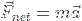
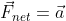
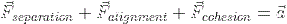
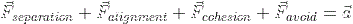

# Boids

This project simulates the flocking behavior that is seen in birds using the principles outlined in Craig Reynolds paper seen [here.](https://www.cs.toronto.edu/~dt/siggraph97-course/cwr87/)
In addition, there is also a physics engine made entirely from scratch. The whole project was made with pure C++ and the SDL2 library for graphics.

The three main ideas that contribute to flocking are:
- Separation: a boid will tend to try and not crowd other close by boids
- Alignment: a boid will attempt to align itself with the average heading of other near by boids
- Cohesion: a boid will adjust it's movement so that it steers towards the center of mass of surrounding boids

The above three rules are applied through Newtons second law of motion.

in this simulation, all boids are considered to have a mass of 1. Because of this, the formula can be adjusted to be:

substituting in the three main forces, we arrive at the equation:

In addition to the three main forces, I also add an additional force to steer the boids away from spawned obstacles, so the final equation is:

We can see this equation in action at the `calculateFNet()` function in the `Boid.cpp` file.

## Controls

- The `o` key spawns an obstacle at the current mouse location
- The `b` key spawns a boids at the current mouse location
- The `i` key will remove the last obstacle you placed
- The `v` key will remove the last boid you placed
- The `p` key will remove all of the obstacles
- The `n` key will remove all of the boids
- The `r` key will completely remove all boids and obstacles at once

## Design

Here is a simplified UML diagram that shows how the project was layed out:

